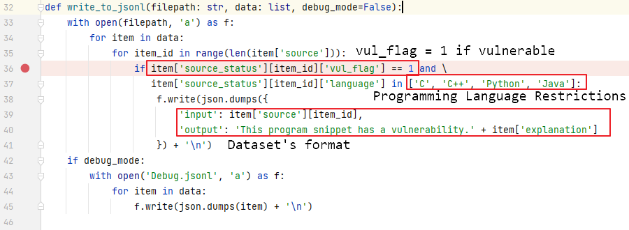
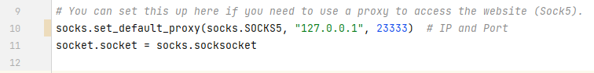

# NIST National Vulnerability Database Crawler

This is a crawler that crawls code snippets with explanations from "https://nvd.nist.gov/vuln/categories" by category
to make it easier to build datasets and test LLM models.

## Components

- `main.py` and `utils.py`

This is the core code for the crawling of the code snippets, just run main.py to do it automatically.

- `nvd_cwe_slice.csv`

This is the categorized information that is stored in csv format to make it easier to capture by category and further
process the information.

| Name    | CWE-ID                                                        | Description                                                                                                                                                                                                                                        | Links                                           |
|---------|---------------------------------------------------------------|----------------------------------------------------------------------------------------------------------------------------------------------------------------------------------------------------------------------------------------------------|-------------------------------------------------|
| CWE-843 | Access of Resource Using Incompatible Type ('Type Confusion') | The program allocates or initializes a resource such as a pointer,  object, or variable using one type, but it later accesses that resource using  a type that is incompatible with the original type.                                             | https://cwe.mitre.org/data/definitions/843.html |
| CWE-824 | Access of Uninitialized Pointer                               | The program accesses or uses a pointer that has not been initialized.                                                                                                                                                                              | https://cwe.mitre.org/data/definitions/824.html |
| CWE-770 | Allocation of Resources Without Limits or Throttling          | The software allocates a reusable resource or group of resources on  behalf of an actor without imposing any restrictions on the size or number of  resources that can be allocated, in violation of the intended security policy  for that actor. | https://cwe.mitre.org/data/definitions/770.html |
| ...     | ...                                                           | ...                                                                                                                                                                                                                                                | ...                                             |

- `fetch_data/*.jsonl`, `dataset.jsonl` and `Debug.jsonl`

This is captured code snippet information, stored in jsonl format. It contains information about the language, whether
it contains vulnerabilities, code snippets and so on. Among them, `fetch_data/*.jsonl` records the data of each
classification, `debug.jsonl` records the data captured throughout the process, and `dataset.json` is the dataset that
takes the code snippet as input and whether it contains vulnerabilities with the vulnerability explanation as output.

```json
{
  "source": [
    "server.sin_family = AF_INET; hp = gethostbyname(argv[1]);if (hp==NULL) error(\"Unknown host\");memcpy( (char *)&server.sin_addr,(char *)hp->h_addr,hp->h_length);if (argc < 3) port = 80;else port = (unsigned short)atoi(argv[3]);server.sin_port = htons(port);if (connect(sock, (struct sockaddr *)&server, sizeof server) < 0) error(\"Connecting\");...while ((n=read(sock,buffer,BUFSIZE-1))!=-1) {\n\nwrite(dfd,password_buffer,n);..."
  ],
  "source_status": [
    {
      "vul_flag": 1,
      "language": "C"
    }
  ],
  "cwe_id": "CWE-312",
  "example_id": "3",
  "explanation": "The following code attempts to establish a connection, read in a password, then store it to a buffer.While successful, the program does not encrypt the data before writing it to a buffer, possibly exposing it to unauthorized actors."
}
```

## Usage

This repository provides both code and datasets. The configuration is:

- Capture only code snippets with vulnerabilities
- `C`, `C++`, `Java`, `Python` code snippets only.
- The input to the dataset is a code snippet and the output is: `This program snippet has a vulnerability.` + *
  *[Vulnerability Explanation]**.
- Use the Sock5 proxy, proxy IP is `127.0.0.1`, proxy port is `23333`.

If you need to modify the restrictions, refer to the description below.

*utils.py*



*main.py*



Simply run main.py after the configuration is complete. If the script does not fetch the content for a long time, it may
have triggered the anti-crawler mechanism, in which case the server will refuse to connect.

Enjoy it ❤